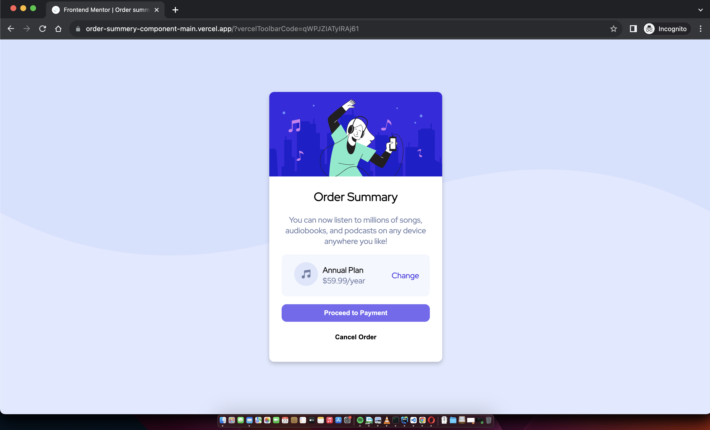

# Frontend Mentor - Order summary card solution

This is a solution to the [Order summary card challenge on Frontend Mentor](https://www.frontendmentor.io/challenges/order-summary-component-QlPmajDUj).

## Table of contents

- [Overview](#overview)
    - [The challenge](#the-challenge)
    - [Screenshot](#screenshot)
    - [Links](#links)
- [My process](#my-process)
    - [Built with](#built-with)
    - [What I learned](#what-i-learned)
    - [Continued development](#continued-development)
    - [Useful resources](#useful-resources)
- [Author](#author)
- [Acknowledgments](#acknowledgments)

**Note: Delete this note and update the table of contents based on what sections you keep.**

## Overview

### The challenge

Users should be able to:

- See order summary card

### Screenshot



### Links

- Solution URL: [order summary solution URL](https://order-summery-component-main-kamania.vercel.app/)

## My process

### Built with

- Semantic HTML5 markup
- CSS custom properties
- Flexbox
- Mobile-first workflow

### What I learned

Use this section to recap over some of your major learnings while working through this project. Writing these out and providing code samples of areas you want to highlight is a great way to reinforce your own knowledge.

To see how you can add code snippets, see below:

```html
<section class="section" id="price-plan">
  <div class="flex-1"></div>
  <div class="flex-2">
    <div><strong>Annual Plan</strong></div>
    <div id="price-value">$59.99/year</div>
  </div>
  <div class="flex-3">
    <a href="#">Change</a>
  </div>
</section>
```
```css
#order-summary > p, #price-value{
  color: hsl(224, 23%, 55%);
}
#price-plan{
  display: flex;
  flex-direction: row;
  justify-content: space-around;
  background-color: hsl(225, 100%, 98%);
  margin-bottom: 1em;
  padding: 1em;
  align-items: center;
  border-radius: 10px;
}
```

### Continued development

I'll later continue to introduce bootstrap 5 into the project

### Useful resources

- [Media Queries - CSS3](https://www.w3schools.com/css/css3_mediaqueries_ex.asp) - This helped me recap Media queries in CSS3.

## Author

- Frontend Mentor - [@Kamania](https://www.frontendmentor.io/profile/Kamania)
- Twitter - [@Josephkamania](https://twitter.com/Josephkamania)


